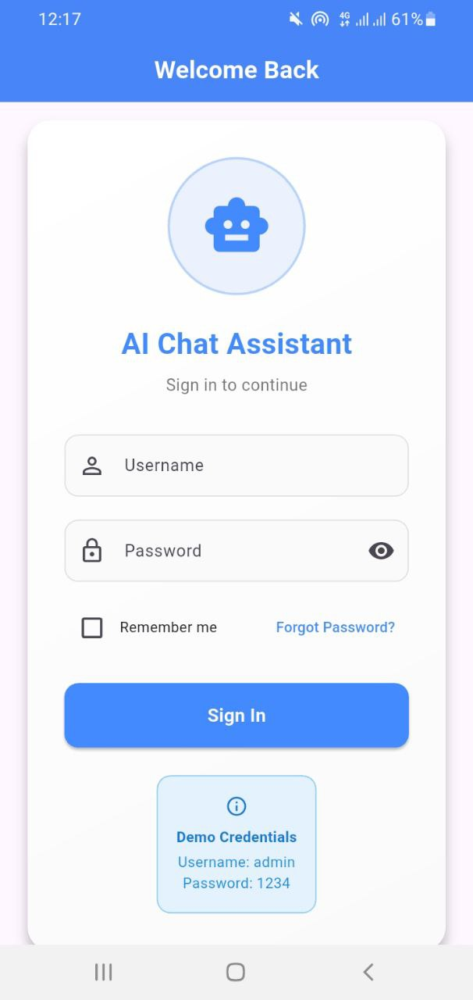
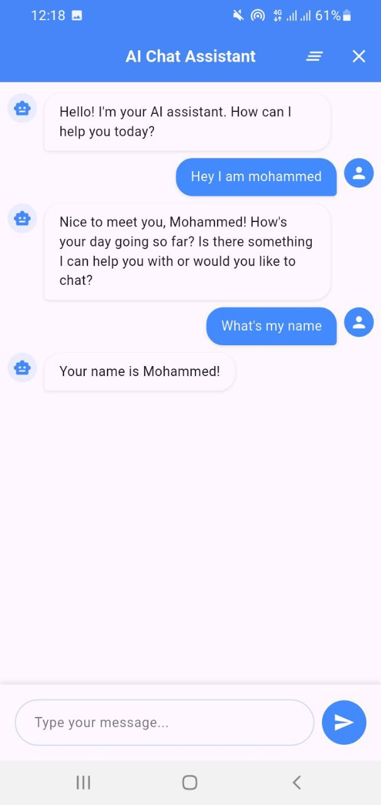
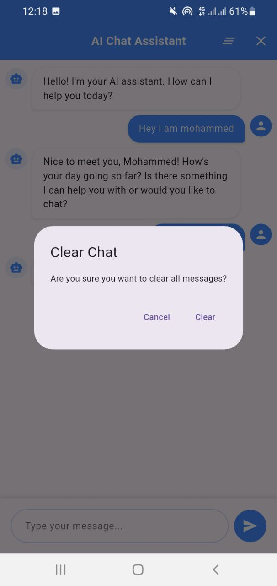

# 📱 Flutter Chat Bot

A simple mobile chatbot application built using **Flutter** and **Hugging Face models**. This project demonstrates chatbot interaction with conversation history, error handling, and basic authentication.

## 🧰 Technologies Used

- **Flutter** – for building the mobile UI  
- **Hugging Face Transformers** – for the chatbot model

## 📸 Screenshots

| Authentication | Chat Interface | Cleared Dialog |
|----------------|----------------|----------------|
|  |  |  |

## 🔐 Features

- **Static Login Page** – a test authentication page to access the chatbot
- **Chat Interface** – displays user and bot messages with error handling
- **Conversation History** – the model remembers the previous messages for context-aware responses
- **Clear Chat Button** – deletes the current dialogue
- **Logout Button** – exits the current session

## 🚀 Getting Started

1. Clone the repository  
   ```bash
   git clone https://github.com/MOHAJII/Flutter_chatbot_app.git
   cd Flutter_chatbot_app
